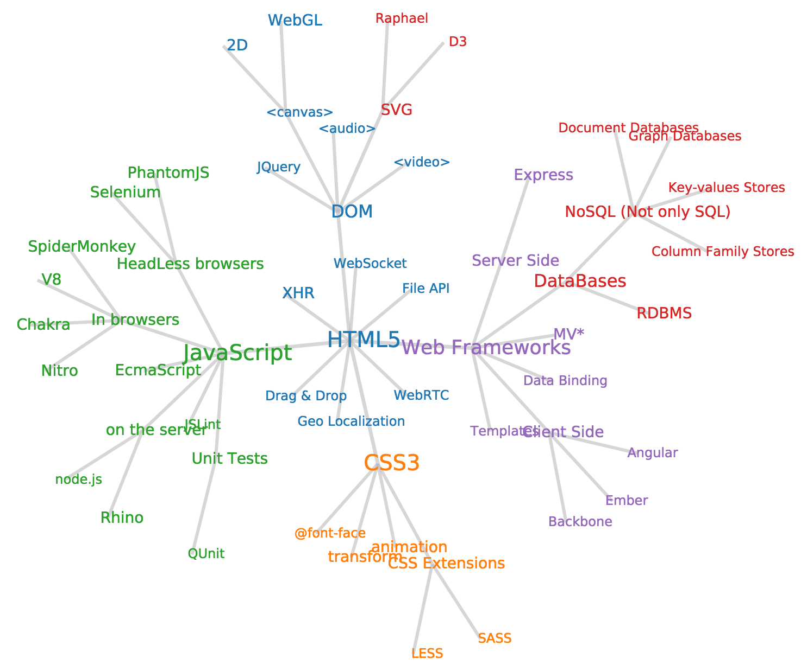

# Web Development Lectures

- Basic tools, protocols, standards and technologies for Web development.
- Main Languages: JavaScript, HTML, CSS
- Client-side and Server-side Web Frameworks.
- Audience: [Master 2](https://www.univ-lehavre.fr/fiches-oiseau/SMMA.pdf) (Course IDOD) from the University of Le Havre.

## Syllabus

This lecture reviews the main technologies and standards used for Web development.

Standards at play are essentially the new HTML5 and CSS3 family of standards as well as new versions of JavaScript (EcmaSript 6).

Technology still relies on the HTTP protocol (althaugh HTTP2 is on its way) for the transport of information. Javascript has become a central language where complete data models rely on it rather than being used for occasional animations on the page.

[Graph Outlook on Codepen](http://codepen.io/pigne/pen/meyVvz)

## Prerequisite

- Good level in an object-oriented programming language
- Basic knowledge in [HTML](https://developer.mozilla.org/en-US/Learn/HTML) and [CSS](https://developer.mozilla.org/en-US/Learn/CSS).
- Basic knowledge in system command line manipulations.

## Oultook

1. (Tools Prerequisite)[prerequisite.md]. 
